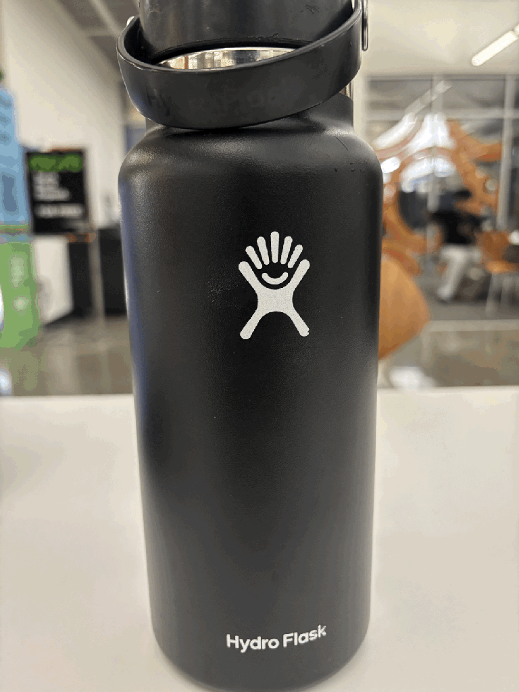
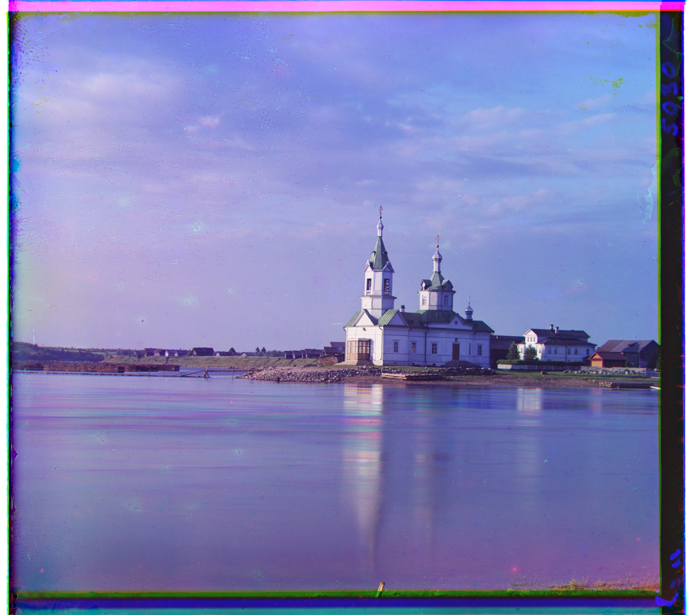

<p align="center">UC BERKELEY · COMPUTER VISION & COMPUTATIONAL PHOTOGRAPHY</p>
<h1 align="center">A study in seeing.</h1>
<p align="center">Rohit Raman · CS 180</p>
<p align="center"><a href="https://rohram.github.io/cs180-/">View the portfolio</a> · <a href="docs/page.pdf">Project 1 write-up</a></p>

<table>
<tr>
<td width="50%" align="center">
<a href="https://rohram.github.io/cs180-/docs/project0/"></a>
<h3>00 / Becoming friends with your camera</h3>
<p>Portraits, perspective compression, and the dolly zoom.</p>
<a href="https://rohram.github.io/cs180-/docs/project0/">Explore Project 0 →</a>
</td>
<td width="50%" align="center">
<a href="https://rohram.github.io/cs180-/docs/project1.html"></a>
<h3>01 / Images of the Russian Empire</h3>
<p>Color-channel alignment with L2 distance, image pyramids, and Sobel edges.</p>
<a href="https://rohram.github.io/cs180-/docs/project1.html">Explore Project 1 →</a>
</td>
</tr>
</table>

## Project 1

The write-up includes all 14 provided images and three additional Library of Congress examples: Woman by a yurt, Lastochkino, and Lugano. Each result lists the green and red channel offsets relative to blue. Pixel-value and Sobel pyramid results are shown separately, with remaining alignment issues discussed.

- [Read the PDF](docs/page.pdf)
- [Computed offsets](docs/offsets.json)
- [Additional image sources](docs/additional-sources.json)

## Repository layout

```text
docs/                 Portfolio website, project pages, and image assets
  index.html          Portfolio homepage
  project0/           Project 0
  project1.html       Project 1
  page.pdf            Project 1 write-up
index.html            Entry point for GitHub Pages
```

## Preview locally

```sh
python3 -m http.server 8000 --directory docs
```

Open http://localhost:8000.

## GitHub Pages

Publish from the `main` branch and the `/ (root)` folder. The root entry point opens the portfolio in `docs/`.

This repository contains the project website and reports. Assignment code is submitted privately through Gradescope. Full-resolution scans, temporary files, and local environments are excluded.
